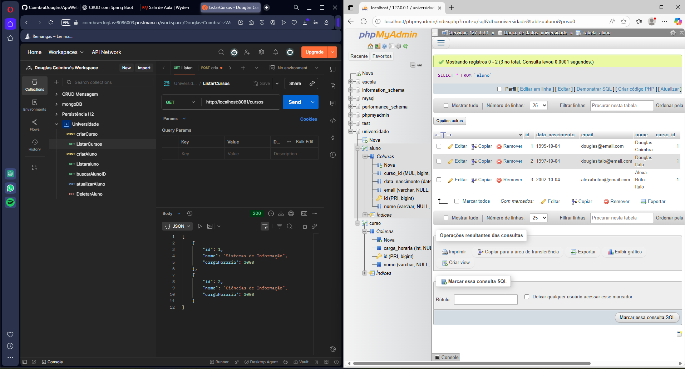

# 📚 API REST - Gerenciamento de Alunos e Cursos

## 📝 Descrição
Este projeto é uma API RESTful desenvolvida com **Spring Boot** e **MariaDB**, que implementa um sistema de gerenciamento de alunos e cursos.  
A aplicação demonstra a utilização de relacionamentos **@ManyToOne** entre entidades (Aluno vinculado a um Curso) e operações CRUD completas.

---

## 🚀 Tecnologias Utilizadas
- Java 17+
- Spring Boot
  - Spring Web
  - Spring Data JPA
  - Lombok
  - Spring DevTools
- MariaDB
- Postman (para testes)

---

## ⚙️ Configuração do Banco de Dados
Antes de rodar a aplicação, crie o banco vazio no MariaDB:

```sql
CREATE DATABASE universidade;
```

E configure o arquivo application.properties:

properties
```
spring.datasource.url=jdbc:mariadb://localhost:3306/universidade
spring.datasource.username=root
spring.datasource.password=
spring.jpa.hibernate.ddl-auto=update
spring.jpa.show-sql=true
spring.jpa.properties.hibernate.dialect=org.hibernate.dialect.MariaDBDialect
```

# Porta da aplicação (caso precise trocar)
server.port=8081
▶️ Como Rodar o Projeto
Certifique-se de que o MariaDB está rodando (via XAMPP ou serviço).

Clone este repositório:

```bash

git clone https://github.com/CoimbraDouglas/AppWeb_BDMariaDB.git
```
Abra o projeto no Visual Studio Code / IntelliJ.

Execute a aplicação Spring Boot (@SpringBootApplication).

A API ficará disponível em:

```arduino

http://localhost:8081
```
📌 Endpoints Disponíveis
📘 Cursos
POST /cursos → Cadastrar curso
JSON Exemplo:

```json

{
  "nome": "Engenharia de Software",
  "cargaHoraria": 3600
}
```
GET /cursos → Listar todos os cursos

GET /cursos/{id} → Buscar curso por ID

PUT /cursos/{id} → Atualizar curso
JSON Exemplo:

```json

{
  "nome": "Ciência da Computação",
  "cargaHoraria": 4000
}
```
DELETE /cursos/{id} → Excluir curso

📗 Alunos
POST /alunos → Cadastrar aluno vinculado a um curso
JSON Exemplo:

```json
{
  "nome": "Douglas Coimbra",
  "email": "douglas@email.com",
  "dataNascimento": "2000-10-01",
  "curso": {
    "id": 1
  }
}
```
GET /alunos → Listar todos os alunos

GET /alunos/{id} → Buscar aluno por ID

PUT /alunos/{id} → Atualizar aluno
JSON Exemplo:

```json

{
  "nome": "Maria Souza",
  "email": "maria@email.com",
  "dataNascimento": "1999-05-21",
  "curso": {
    "id": 2
  }
}
```
DELETE /alunos/{id} → Excluir aluno

🧪 Testes no Postman
Rode a aplicação.

Abra o Postman e faça requisições para os endpoints listados acima.

Exemplo de requisição POST para cadastrar curso:

```

POST http://localhost:8081/cursos
Body → raw → JSON
{
  "nome": "Sistemas de Informação",
  "cargaHoraria": 3200
}
```


---

📂 Estrutura do Projeto
bash
Copiar código
src/
 ├── main/
 │   ├── java/com/seuprojeto/
 │   │   ├── controller/
 │   │   ├── model/
 │   │   ├── repository/
 │   │   ├── service/
 │   │   └── Application.java
 │   └── resources/
 │       └── application.properties
 └── test/

 ---
 
👨‍💻 Autor
Projeto desenvolvido por Douglas Coimbra 🚀
